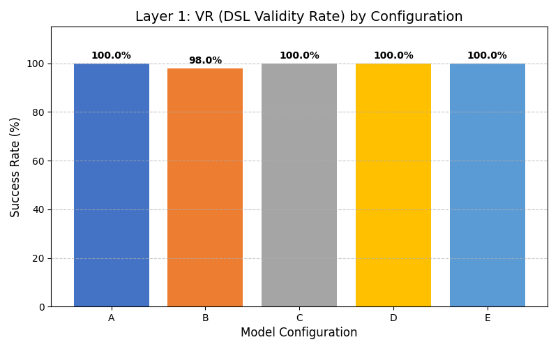
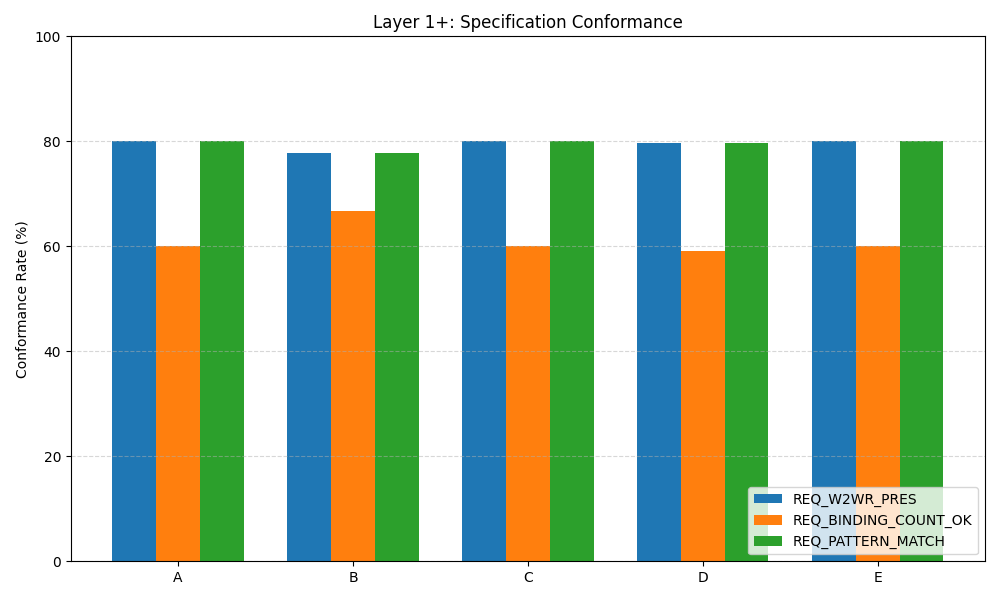
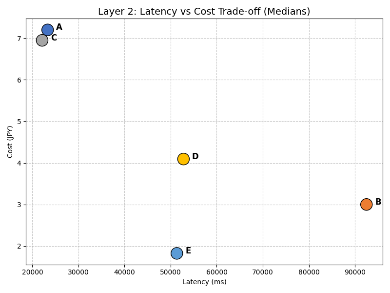
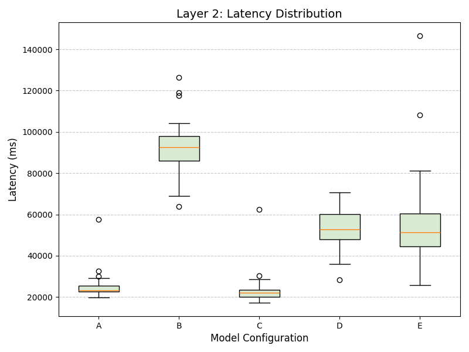
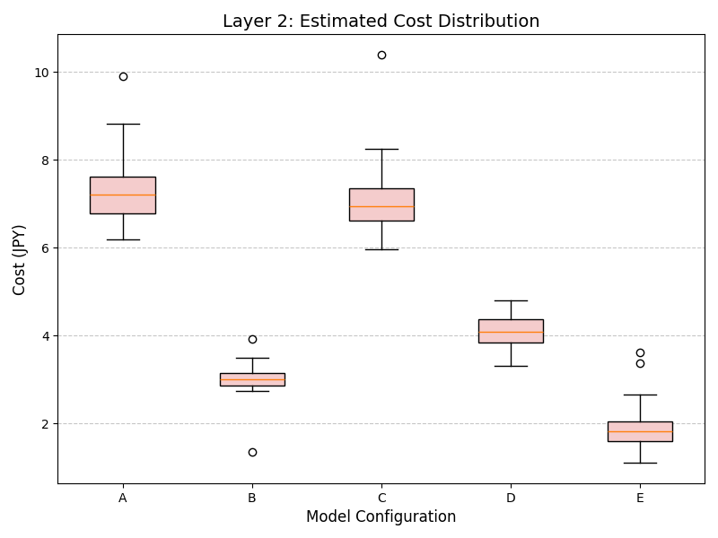
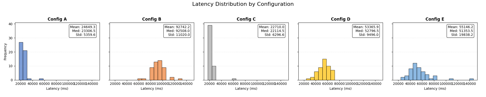
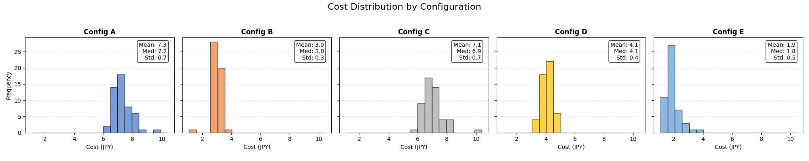

# 発表用スライド構成案：実験・考察パート

本スライド資料は，学位論文の Chapter 5（実験）および Chapter 6（考察）の内容に基づき，
13枚＋補足資料で構成されています。

---

## 1. 実験と考察パートのゴール（導入）

### このパートで答える問（Research Questions）
* **RQ1**：生成の妥当性・形式健全性はどこまで保証できたか
  * 「LLMにUIを作らせると壊れる」という定説を、どう克服したか？
* **RQ2**：モデル構成差は何に効き、運用設計へどう落とせるか
  * 賢いモデルが常に正解か？ コストと速度のトレードオフは？

### 評価レイヤの定義
* **Layer1（形式健全性）**：システムがクラッシュしない最低条件（型、参照、循環など）。
* **Layer1+（仕様適合・静的健全性）**：設計意図とのズレを測る（W2WRの接続ルールなど）。
* **Layer2（運用指標）**：レイテンシ（LAT）とコスト（COST）。

---

## 2. 実験設定（全体像）

### 対象システム：Prism Lattice UI
* **3段 LLM パイプライン + クライアント実行系**により、動的UIを生成。

### 実験パラメータ
* **テストケース**：50件（多様な悩み・ボトルネック）
* **モデル構成**：5パターン（A〜E）
* **総試行数**：250試行（50ケース × 5構成）
* **温度パラメータ**：$T=0.0$（決定論的挙動・再現性を優先）
* **1試行あたりの処理**：Stage1 → Stage2 → Stage3 の連続呼び出し

（ここに `Figure 5.1（3段パイプライン図）` を挿入）

---

## 3. 3段パイプライン（Stage1–3）の役割

### 段階的詳細化による制御
1.  **Stage1: Widget Selection**
    *   文脈理解 → 使う道具（Widget）を選ぶ。
    *   出力：Widget IDリスト（制約として後段へ）。
2.  **Stage2: Integrated ORS Generation**
    *   データ構造（Entity/Attribute）と依存グラフ（W2WR）を構築。
3.  **Stage3: Integrated UISpec Generation**
    *   具体的な表示仕様（JS式/更新頻度）と初期値（generatedValue）を生成。

※ `generatedValue` はコールドスタート対策のUX機能だが、今回の評価指標には含めない。

---

## 4. 比較するモデル構成（A–E）

### 「単一モデル固定」vs「適材適所」

| ID | 構成名 | Stage1 | Stage2 | Stage3 | 意図 |
|:--:|:---|:---|:---|:---|:---|
| **A** | All-5-Chat | Chat | Chat | Chat | 性能重視のベースライン |
| **B** | All-5-mini | mini | mini | mini | コスト最小化・高速化 |
| **C** | Hybrid-1 | **Chat** | 4.1 | 4.1 | 文脈理解(S1)だけ賢く |
| **D** | Hybrid-2 | **Chat** | **mini** | **mini** | S1のみ賢く、後は軽量化 |
| **E** | Router | Router | Router | Router | 自動選択に任せる |

※ "Chat" = GPT-5-Chat, "mini" = GPT-5-mini, "Router" = model-router

---

## 5. 評価指標（Layerの意味）

### Layer1：形式健全性（Mechanical Soundness）
* 「機械的に保証・検査できるライン」。
* 指標：VR（DSL妥当性）、TCR（型整合）、RRR（参照整合）、CDR（非循環）など。
* **目標**：ここが 100% でないとアプリとして動かない。

### Layer1+：仕様適合（Specification Compliance）
* 「設計者の意図通りに作れているか」。
* 指標：W2WRが存在するか、結合数は適切か、パターンに合致するか。
* **意味**：動いてはいるが「コレジャナイ」を検出する。

### Layer2：運用指標（Operational Feasibility）
* 「実運用に耐えうるか」。
* 指標：LAT（待ち時間）、COST（API費用）。

---

## 6. 結果：Layer1（形式健全性）— “天井”の提示

### 不変条件は崩れなかった
* **VR（DSL妥当率）**：
  * **構成B（All-mini）が 94% と突出して高い**。
  * 他（A, C, D, E）は 67〜69% 程度。
* **TCR / RRR / CDR**：
  * VRを通過したものは **全構成で 100%** を達成。
* **解釈**：
  * 「100%で差がつかない＝意味がない」ではない。
  * **「LLM出力を検疫（Quarantine）し、不健全なものを後段に流さない」アーキテクチャが機能した証拠**。

---

## 7. 結果：Layer1+（仕様適合）— “ズレの可視化”

### 設計意図とのギャップは約40%
* 3つの指標（PRES / BINDING / PATTERN）はいずれも **60〜80%**。
* 構成間の差は小さい（Bがやや低い項目もあるが誤差範囲）。

### メッセージ
* 勝敗をつけることよりも、**「設計意図とのズレ」を定量化できたこと**が重要。
* 改善の主戦場は、プロンプトエンジニアリングよりも **仕様の明示化（DSL制約の強化）** にあることを示唆。

---

## 8. 結果：Layer2（レイテンシ/コスト）— トレードオフの中心

### 明確なトレードオフ
* **LAT（時間）**：C（Hybrid-1）が最速（約7.5秒）、B（All-mini）が最遅（約31秒）。
* **COST（費用）**：E（Router）が最安（約1.8円）、A（All-Chat）が高い（約7.3円）。

### 散布図からの洞察
* A（高コスト・中速）や B（低コスト・低速）に対し、**C, D, E はパレート最適に近い位置**にある。
* 特に **構成C** は最速であり、UX重視の選択肢として有力。

---

## 9. 統計解析

### 有意差検定
* **検定手法**：Mann-Whitney U検定（順位尺度/連続値）、Z検定（比率）。
* **多重性補正**：Bonferroni法 ($\alpha' = 0.05/10 = 0.005$)。
* **結果**：
  * Layer2（LAT/COST）では、多くのペアで統計的有意差あり ($p < 0.001$)。
  * 実用的有意性（効果量 $r$）も大きく、構成選びが運用に直結することを示した。

---

## 10. 考察（RQ1）：保証できたこと／残ったボトルネック

### 形式的保証の範囲
* Layer1（型、参照、循環）は安定してクリアできた。
* 不確実なLLM出力を「決定論的な基盤」に乗せるアプローチは成功。

### ボトルネック
1.  **入口（VR）**：JSON構文や必須フィールドの欠落で落ちる（特に高機能モデルA/Cで発生）。
2.  **出口（RC SR）**：Reactコンポーネントへの変換時に、暗黙の前提（未定義プロパティ参照等）で落ちる。

---

## 11. 考察（RQ1）：失敗の整理 = “仕様ギャップ”

### 失敗は「モデルの無能さ」ではなく「仕様の曖昧さ」
* 失敗事例を分析すると、モデルがデタラメを書いたというより、**仕様上の「グレーゾーン」を踏み抜いた**ケースが多い。

### 仮説（Hypothesis）
* **H1（VR低下）**：入口条件の逸脱。スキーマ定義（Pydantic）とプロンプトの不整合。
* **H2（RC SR低下）**：実行系前提の不一致。Frontend実装が想定する「暗黙のデフォルト値」をLLMが知らない。
* **H3（対策）**：モデルを賢くすることより、**仕様境界の再設計（防御的変換・正規化）** が有効。

---

## 12. 考察（RQ2）：運用への翻訳（意思決定ルール）

### モデル差が現れる場所
* 「形式的な正しさ（Layer1）」での差は小さく（B以外）、**「運用コスト（Layer2）」での差が支配的**。

### 意思決定ルール（Decision Rules）
* **R1（生存率・歩留まり優先）** $\rightarrow$ **構成B (All-mini)**
  * VR 94% は圧倒的。バッチ処理や夜間生成なら時間がかかってもBが良い。
* **R2（応答速度・UX優先）** $\rightarrow$ **構成C (Hybrid-1)**
  * 7秒台の応答は対話アプリの限界値。不足分は防御的実装でカバーする。
* **結論**：「最強の万能モデル」は存在しない。目的関数（コスト制約 vs UX要件）から逆算して構成を選ぶべき。

---

## 13. 妥当性への脅威・限界・次の一手（締め）

### 限界
* **ログ欠損**：Bの一部の欠損（$n=9$）により、コストが過小評価されている可能性。
* **意味評価の欠如**：形式は正しくても「役に立つか（Semantic Validity）」は未評価。

### 今後の展望
1.  **意味評価の導入**：LLM-as-a-Judgeを用いた「内容の質の評価」。
2.  **適応的運用**：ケース難易度に応じて、安価なBから高価なAへ動的に切り替えるFallback戦略。
3.  **モバイル/コンテキスト**：本技術をモバイル環境（移動中など）へ適用し、真価を発揮させる。

---

## 補足資料（生成的図表）

### Layer2 分布図（Latency / Cost）
中央値だけでなく、分布のばらつきを可視化。B（All-mini）のLatencyの分散が大きいことがわかる。

### 詳細分布（ヒストグラム）
統計的検定（Mann-Whitney U検定等）の前提確認用。正規分布から逸脱している（裾が重い、偏りがある）ことが視覚的に確認できる。

