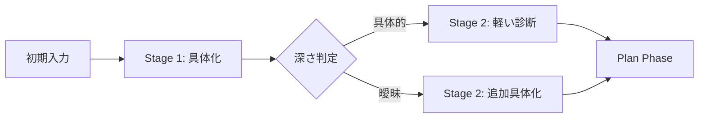

# Capture Phase Requirements v3.0
## Captureフェーズ要求仕様書

**Version**: 3.0
**Date**: 2025-11-14
**Base Spec**: [DSL Core Spec v3.0](./DSL-Core-Spec-v3.0.md)
**Purpose**: 悩み事の具体化とボトルネック診断

---

## 1. フェーズ概要

### 1.1 目的

Captureフェーズは以下の2つの目的を持つ：

1. **悩み事の具体化**: ユーザーの漠然とした悩みを明確化
2. **ボトルネック診断**: 思考を妨げている要因の特定

### 1.2 動的化レベル

- **レベル**: 限定的動的
- **範囲**: 質問内容と順序の調整、観点の動的追加
- **固定要素**: UIウィジェット種類、基本レイアウト

### 1.3 2段階構造



---

## 2. Stage 1: 悩み事の具体化

### 2.1 初期入力

**必須フィールド**:
```json
{
  "id": "initial_concern",
  "type": "text_input",
  "attributes": [
    {
      "name": "description",
      "type": "sval",
      "constraints": [
        {"type": "required", "value": true},
        {"type": "min", "value": 10, "message": "10文字以上で入力してください"}
      ]
    }
  ]
}
```

### 2.2 基本質問セット

**最小構成（3問）**:

```json
{
  "questions": [
    {
      "id": "q1_context",
      "text": "この悩みはいつから続いていますか？",
      "type": "select",
      "options": ["数日前から", "1週間前から", "1ヶ月前から", "それ以上前から"]
    },
    {
      "id": "q2_impact",
      "text": "この悩みが日常生活にどの程度影響していますか？",
      "type": "radio",
      "options": ["ほとんど影響ない", "少し影響がある", "かなり影響がある", "深刻に影響している"]
    },
    {
      "id": "q3_attempts",
      "text": "これまでに試した解決方法があれば教えてください",
      "type": "text",
      "optional": true
    }
  ]
}
```

### 2.3 動的生成可能な要素

- 質問の順序
- フォローアップ質問の有無
- 選択肢の内容（悩みの内容に基づく）

---

## 3. Stage 2: ボトルネック診断

### 3.1 診断トリガー条件

初期入力の解析により、以下のパターンを検出：

```typescript
interface ConcernAnalysis {
  depth: "specific" | "vague" | "mixed";
  indicators: {
    hasSpecificProblem: boolean;
    hasEmotionalWords: boolean;
    hasMultipleIssues: boolean;
    hasUncertainty: boolean;
  };
}
```

### 3.2 ボトルネックタイプ定義

```typescript
enum BottleneckType {
  TOO_MANY_OPTIONS = "too_many_options",           // 選択肢が多すぎる
  NO_STARTING_POINT = "no_starting_point",         // 何から考えればいいか分からない
  ENTANGLED_PROBLEMS = "entangled_problems",       // 複数の問題が絡んでいる
  EMOTIONAL_BLOCK = "emotional_block",             // 感情的ブロック
  INSUFFICIENT_INFO = "insufficient_info",         // 情報不足
  FEAR_OF_DECISION = "fear_of_decision",          // 決断への恐れ
  FIXED_PERSPECTIVE = "fixed_perspective",         // 視点固定
  NO_PRIORITIZATION = "no_prioritization"          // 優先順位がつけられない
}
```

### 3.3 診断質問マッピング

```javascript
const diagnosticQuestions = {
  too_many_options: [
    {
      id: "diag_options_count",
      text: "検討している選択肢はいくつくらいありますか？",
      type: "select",
      options: ["2-3個", "4-5個", "6個以上", "数えきれない"]
    },
    {
      id: "diag_options_appeal",
      text: "どの選択肢も同じくらい魅力的に見えますか？",
      type: "radio",
      options: ["はい", "いいえ", "わからない"]
    }
  ],

  emotional_block: [
    {
      id: "diag_emotion_type",
      text: "この悩みを考えるとき、どんな感情を感じますか？",
      type: "multi_select",
      options: ["不安", "恐れ", "焦り", "罪悪感", "怒り", "悲しみ"]
    },
    {
      id: "diag_emotion_barrier",
      text: "感情が判断を妨げていると感じますか？",
      type: "radio",
      options: ["強く感じる", "少し感じる", "感じない"]
    }
  ],

  no_starting_point: [
    {
      id: "diag_framework",
      text: "考える枠組みや手がかりが欲しいと感じますか？",
      type: "radio",
      options: ["とても欲しい", "あれば助かる", "特に必要ない"]
    },
    {
      id: "diag_similar_experience",
      text: "似たような問題を解決した経験はありますか？",
      type: "radio",
      options: ["ある", "部分的にある", "ない"]
    }
  ],

  entangled_problems: [
    {
      id: "diag_problem_count",
      text: "関連する問題はいくつありそうですか？",
      type: "select",
      options: ["1つ（単独）", "2-3個", "4個以上", "わからない"]
    },
    {
      id: "diag_interdependency",
      text: "一つを解決しようとすると、別の問題が生じる状況ですか？",
      type: "radio",
      options: ["はい", "部分的にそう", "いいえ"]
    }
  ]
};
```

### 3.4 診断質問の選択ロジック

```typescript
function selectDiagnosticQuestions(
  analysis: ConcernAnalysis,
  maxQuestions: number = 3
): DiagnosticQuestion[] {

  const priority = determinePriority(analysis);
  const questions = [];

  // 優先度の高いボトルネックから質問を選択
  for (const bottleneck of priority) {
    if (questions.length >= maxQuestions) break;

    const bottleneckQuestions = diagnosticQuestions[bottleneck];
    questions.push(bottleneckQuestions[0]); // 各タイプの最初の質問を選択
  }

  return questions;
}
```

---

## 4. UIコンポーネント仕様

### 4.1 利用可能なウィジェット

| Widget Type | 用途 | 動的性 |
|------------|------|--------|
| text_input | 自由記述 | 内容のみ動的 |
| text_area | 長文入力 | 内容のみ動的 |
| radio | 単一選択 | 選択肢が動的 |
| select | ドロップダウン選択 | 選択肢が動的 |
| multi_select | 複数選択 | 選択肢が動的 |
| scale | 段階評価 | ラベルが動的 |

### 4.2 レイアウト制約

```json
{
  "layout": {
    "type": "sequential",
    "max_questions_per_screen": 3,
    "show_progress": true,
    "allow_back": true,
    "skip_optional": true
  }
}
```

---

## 5. 出力仕様（Plan フェーズへの連携）

### 5.1 CaptureOutput インターフェース

```typescript
interface CaptureOutput {
  // 悩み事の内容
  concern: {
    description: string;
    context: string[];
    constraints: string[];
    attemptedSolutions: string[];
  };

  // ボトルネック診断結果
  bottleneckAnalysis: {
    primaryType: BottleneckType;
    secondaryTypes: BottleneckType[];
    confidence: number; // 0.0 - 1.0
    diagnosticResponses: Record<string, any>;
  };

  // ユーザー特性（推定）
  userCharacteristics: {
    thinkingStyle: 'visual' | 'analytical' | 'intuitive' | 'dialogical';
    decisionPattern: 'quick' | 'deliberate' | 'avoidant';
    emotionalState: 'calm' | 'anxious' | 'frustrated' | 'hopeful';
    engagementLevel: 'low' | 'medium' | 'high';
  };

  // メタデータ
  metadata: {
    captureTime: number; // milliseconds
    questionCount: number;
    skippedQuestions: string[];
    version: "3.0";
  };
}
```

---

## 6. LLMプロンプト設計ガイド

### 6.1 Stage 1 プロンプト構造

```
あなたは思考整理の専門家です。
ユーザーの悩み「{initial_concern}」を具体化するため、
以下の観点から3つの質問を生成してください：

1. 状況の詳細化
2. 影響範囲の明確化
3. これまでの取り組み

質問は簡潔で答えやすいものにしてください。
```

### 6.2 Stage 2 プロンプト構造

```
Stage 1の回答を分析した結果、以下の特徴が見られます：
- {analysis_results}

この分析に基づき、思考のボトルネックを特定するため、
最大3つの診断質問を選択してください。

利用可能な診断質問：
{diagnostic_questions_pool}

ユーザーの負担を最小限にしながら、
効果的な診断ができる質問を選んでください。
```

---

## 7. エラーハンドリング

### 7.1 フォールバック戦略

```typescript
const fallbackStrategies = {
  // 診断失敗時
  diagnosisFailed: {
    action: "skip_stage2",
    defaultBottleneck: BottleneckType.NO_STARTING_POINT
  },

  // 空回答が続く場合
  emptyResponses: {
    action: "reduce_questions",
    minQuestions: 1
  },

  // タイムアウト
  timeout: {
    action: "save_partial",
    nextPhase: "plan_with_minimal_info"
  }
};
```

---

## 8. パフォーマンス指標

### 8.1 目標値

| 指標 | 目標 | 許容範囲 |
|------|------|----------|
| 完了率 | 85% | 75-95% |
| 平均質問数 | 5問 | 3-8問 |
| 平均所要時間 | 3分 | 2-5分 |
| 診断精度 | 70% | 60-80% |

### 8.2 最適化ポイント

- 質問の自動スキップ（類似回答検出）
- 動的な質問数調整（エンゲージメントレベルに基づく）
- 回答パターンの学習と予測

---

## 9. 実装チェックリスト

- [ ] Stage 1の基本質問生成
- [ ] 初期入力の深さ解析
- [ ] Stage 2の条件付き表示
- [ ] ボトルネック診断ロジック
- [ ] 診断質問の動的選択
- [ ] CaptureOutput の生成
- [ ] エラーハンドリング実装
- [ ] Plan フェーズへの連携

---

## 10. 将来の拡張

### 10.1 機械学習による最適化

- ユーザーの回答パターン学習
- 診断精度の向上
- 質問の自動生成

### 10.2 マルチモーダル入力

- 音声入力対応
- 画像による状況説明
- 手書きメモの取り込み

---

## 付録: 実装例

```json
{
  "phase": "capture",
  "version": "3.0",
  "stages": [
    {
      "id": "stage_1",
      "type": "clarification",
      "questions": [
        {
          "id": "q1",
          "text": "転職を考え始めたきっかけは何ですか？",
          "type": "text_area",
          "required": true
        },
        {
          "id": "q2",
          "text": "現在の仕事で最も不満な点は？",
          "type": "radio",
          "options": ["給与", "人間関係", "仕事内容", "成長機会", "その他"]
        }
      ]
    },
    {
      "id": "stage_2",
      "type": "diagnosis",
      "condition": "analysis.depth === 'specific'",
      "questions": [
        {
          "id": "diag_1",
          "text": "転職先の選択肢はいくつありますか？",
          "type": "select",
          "options": ["1社", "2-3社", "4社以上", "まだ探していない"]
        }
      ]
    }
  ]
}
```