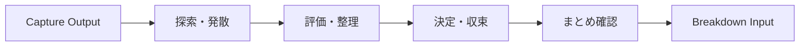

# Plan Phase Requirements v3.0
## Planフェーズ要求仕様書

**Version**: 3.0
**Date**: 2025-11-14
**Base Spec**: [DSL Core Spec v3.0](./DSL-Core-Spec-v3.0.md)
**Reference**: [discussion_p4_plan.md](../../project/discussion_p4_plan.md)
**Purpose**: ボトルネックに応じた動的UI生成による思考支援

---

## 1. フェーズ概要

### 1.1 目的

Planフェーズは、Captureフェーズで特定されたボトルネックに対して、最適な思考支援UIを動的に生成し、ユーザーの問題解決を支援する。

### 1.2 動的化レベル

- **レベル**: 🌟 フル動的
- **範囲**: UIの構造・順序・組み合わせ自体を動的生成
- **焦点**: ユーザーの思考パターンに合わせたUI自体の生成

### 1.3 差別化ポイント

| 観点 | 静的UI + コンテンツ生成 | 本システム（動的UI生成） |
|------|----------------------|------------------------|
| UI構造 | 固定 | 悩みとボトルネックに応じて変化 |
| フロー | 全員同じ | 個別最適化された3段階フロー |
| 思考支援 | コンテンツで誘導 | インタラクション様式自体で誘導 |

---

## 2. 3段階フローモデル

### 2.1 フロー構造



### 2.2 各段階の定義

```typescript
interface PhaseFlow {
  stages: [
    {
      id: "diverge",
      name: "探索・発散",
      timing: [0.0, 0.4],
      purpose: "制約なく可能性を広げる",
      cognitive_mode: ["free_association", "metaphorical", "dialogical"]
    },
    {
      id: "evaluate",
      name: "評価・整理",
      timing: [0.3, 0.7],
      purpose: "アイデアを構造化・関連付け",
      cognitive_mode: ["structural", "categorical", "causal"]
    },
    {
      id: "converge",
      name: "決定・収束",
      timing: [0.6, 1.0],
      purpose: "優先順位をつけて方針確定",
      cognitive_mode: ["evaluative", "comparative", "decisive"]
    },
    {
      id: "summary",
      name: "まとめ確認",
      timing: [1.0, 1.0],
      purpose: "結果の構造化表示と修正機会",
      cognitive_mode: ["integrative", "reflective"]
    }
  ]
}
```

**注**: timing値の重複により、段階間のスムーズな移行を実現

---

## 3. UIコンポーネントライブラリ

### 3.1 コンポーネント一覧

| ID | 名称 | timing | versatility | 認知モード | 対象ボトルネック |
|----|------|--------|-------------|-----------|----------------|
| **発散・探索フェーズ** |
| UC01 | ブレインストームカード | 0.05 | 0.9 | 自由連想 | 何から考えればいいか分からない、情報不足 |
| UC02 | アナロジー選択UI | 0.15 | 0.7 | 比喩的思考 | 何から考えればいいか分からない、視点固定 |
| UC03 | 質問カード連鎖 | 0.2 | 0.85 | 対話的探索 | 情報不足、何から考えればいいか分からない |
| UC04 | マインドマップ生成 | 0.25 | 0.75 | 視覚的関連付け | 複数の問題が絡んでいる、情報が整理されていない |
| UC05 | 感情カラーパレット | 0.1 | 0.6 | 感情的気づき | 感情的ブロック、決断への恐れ |
| **発散・整理の橋渡し** |
| UC06 | 時間軸スライダー | 0.35 | 0.7 | 時間的視点 | 視点固定、選択肢が少ない |
| UC07 | ペルソナ視点切替 | 0.35 | 0.65 | 多角的視点 | 視点固定、選択肢が少ない |
| UC08 | 問題分解ツリー | 0.4 | 0.7 | 構造的分解 | 複数の問題が絡んでいる、何から考えればいいか分からない |
| **整理・評価フェーズ** |
| UC09 | カード仕分けUI | 0.45 | 0.8 | カテゴリー化 | 選択肢が多すぎる、情報が整理されていない |
| UC10 | 依存関係マッピング | 0.5 | 0.55 | 因果関係分析 | 複数の問題が絡んでいる、優先順位がつけられない |
| UC11 | SWOT分析UI | 0.5 | 0.6 | 多面的評価 | 情報が整理されていない、視点固定 |
| **収束・決定フェーズ** |
| UC12 | マトリックス配置 | 0.6 | 0.75 | 二軸評価 | 選択肢が多すぎる、優先順位がつけられない |
| UC13 | トレードオフ天秤 | 0.7 | 0.5 | バランス調整 | 決断への恐れ、選択肢が多すぎる |
| UC14 | 優先度スライダーグリッド | 0.75 | 0.65 | 重み付け評価 | 優先順位がつけられない、選択肢が多すぎる |
| UC15 | 二択比較連鎖 | 0.8 | 0.4 | トーナメント式 | 選択肢が多すぎる、決断への恐れ |
| UC16 | シナリオ分岐ツリー | 0.85 | 0.55 | 未来シミュレーション | 決断への恐れ、情報不足 |
| UC17 | リソース配分パイ | 0.75 | 0.5 | 資源配分 | 優先順位がつけられない、複数の問題が絡んでいる |
| **まとめ・確認フェーズ** |
| UC18 | 構造化文章まとめ | 1.0 | 1.0 | 統合・確認 | 全ボトルネック（最終確認） |

### 3.2 コンポーネントメタデータ

```typescript
interface UIComponent {
  id: string;
  name: string;
  timing: number;         // 0.0 - 1.0
  versatility: number;    // 0.0 - 1.0
  cognitive_mode: CognitiveMode[];
  bottlenecks: BottleneckType[];

  // UI固有の設定
  props: {
    interactive: boolean;
    visual_style: "minimal" | "rich" | "balanced";
    input_type: "selection" | "manipulation" | "creation" | "hybrid";
    feedback_mode: "immediate" | "delayed" | "cumulative";
  };

  // 状態受け渡し
  state_interface: {
    input: Record<string, any>;
    output: Record<string, any>;
    preserved: string[];  // 次段階に引き継ぐ状態キー
  };
}
```

---

## 4. UIコンポーネント選択アルゴリズム

### 4.1 選択ロジック

```javascript
function selectUIFlow(captureOutput: CaptureOutput): UIFlow {
  const { bottleneckAnalysis, userCharacteristics } = captureOutput;

  // Step 1: ボトルネックに基づく候補選択
  const candidates = UIComponentLibrary.filter(component =>
    component.bottlenecks.includes(bottleneckAnalysis.primaryType)
  );

  // Step 2: タイミングによるフィルタリング
  const divergeComponents = candidates.filter(c => c.timing >= 0.0 && c.timing <= 0.4);
  const evaluateComponents = candidates.filter(c => c.timing >= 0.3 && c.timing <= 0.7);
  const convergeComponents = candidates.filter(c => c.timing >= 0.6 && c.timing <= 1.0);

  // Step 3: ユーザー特性によるスコアリング
  const scoreByUserFit = (component: UIComponent) => {
    let score = component.versatility; // 基本スコア

    // 思考スタイルとの適合性
    if (matchesThinkingStyle(component, userCharacteristics.thinkingStyle)) {
      score += 0.2;
    }

    // エンゲージメントレベルによる調整
    if (userCharacteristics.engagementLevel === 'low' && component.versatility > 0.7) {
      score += 0.1; // 低エンゲージメントには汎用性の高いUIを優先
    }

    return score;
  };

  // Step 4: 各フェーズで最適なコンポーネントを選択
  const flow = {
    diverge: selectBest(divergeComponents, scoreByUserFit),
    evaluate: selectBest(evaluateComponents, scoreByUserFit),
    converge: selectBest(convergeComponents, scoreByUserFit),
    summary: UIComponentLibrary.find(c => c.id === 'UC18') // 固定
  };

  // Step 5: 確信度が低い場合の調整
  if (bottleneckAnalysis.confidence < 0.7) {
    flow.diverge = getHighVersatilityComponent('diverge');
  }

  return flow;
}
```

### 4.2 フォールバック戦略

```typescript
const fallbackFlow = {
  low_confidence: [
    "UC03", // 質問カード連鎖（汎用性高）
    "UC09", // カード仕分けUI
    "UC12", // マトリックス配置
    "UC18"  // 構造化文章まとめ
  ],

  minimal_engagement: [
    "UC01", // ブレインストーム（シンプル）
    "UC12", // マトリックス配置
    "UC18"  // 構造化文章まとめ
  ],

  error_recovery: [
    "UC03", // 質問カード連鎖
    "UC18"  // 構造化文章まとめ
  ]
};
```

---

## 5. 状態管理と受け渡し

### 5.1 フロー間の状態伝達

```typescript
interface FlowState {
  // 各段階の出力を蓄積
  stages: {
    diverge: {
      ideas: string[];
      themes: string[];
      emotions?: EmotionalState;
    };
    evaluate: {
      categories: Category[];
      relationships: Relationship[];
      priorities?: Priority[];
    };
    converge: {
      decisions: Decision[];
      rationale: string[];
      confidence: number;
    };
  };

  // 累積的な洞察
  insights: {
    key_factors: string[];
    eliminated_options: string[];
    discovered_constraints: string[];
  };

  // メタデータ
  metadata: {
    timestamp: number;
    ui_sequence: string[];
    interaction_count: number;
    backtrack_count: number;
  };
}
```

### 5.2 Breakdownフェーズへの出力

```typescript
interface PlanOutput {
  // 構造化された結果テキスト
  summary: string; // 1つの長い構造化テキスト

  // 決定事項
  decisions: {
    primary: string;
    alternatives: string[];
    constraints: string[];
  };

  // プロセスの記録
  process: {
    ui_flow: string[];
    key_insights: string[];
    turning_points: string[];
  };

  // 次フェーズへの推奨事項
  recommendations: {
    task_complexity: "simple" | "moderate" | "complex";
    breakdown_approach: "sequential" | "parallel" | "hierarchical";
    estimated_steps: number;
  };
}
```

---

## 6. LLMプロンプト設計

### 6.1 UI選択プロンプト

```
## コンテキスト
ユーザーの悩み: {concern_description}
ボトルネック診断: {bottleneck_type} (確信度: {confidence})
ユーザー特性: {user_characteristics}

## タスク
上記の情報に基づき、3段階の思考支援フローを設計してください。

## 利用可能なUIコンポーネント
{ui_component_library}

## 選択基準
1. ボトルネックタイプとの適合性を最優先
2. timing値に従った段階的な思考支援
3. versatilityとユーザー特性のマッチング
4. 認知的負荷の適切な分散

## 出力形式
{
  "flow": [
    {"stage": "diverge", "component_id": "UC##", "rationale": "..."},
    {"stage": "evaluate", "component_id": "UC##", "rationale": "..."},
    {"stage": "converge", "component_id": "UC##", "rationale": "..."}
  ]
}
```

### 6.2 コンポーネント内容生成プロンプト

```
## 現在のUI
コンポーネント: {component_name}
段階: {current_stage}
目的: {stage_purpose}

## これまでの文脈
前段階の出力: {previous_output}
累積的洞察: {accumulated_insights}

## タスク
このUIコンポーネントの具体的な内容を生成してください。
ユーザーの悩み「{concern}」に対して、{component_name}を使って
{stage_purpose}を達成するための要素を作成してください。

## 生成内容
{component_specific_requirements}
```

---

## 7. クリエイティブUIパターン

### 7.1 ボトルネック別推奨フロー

#### パターン1: 選択肢過多への対処
```
Flow: [発散スキップ] → UC09(仕分け) → UC12(マトリックス) → UC15(二択比較) → UC18(まとめ)
理由: すでに選択肢があるため、整理と絞り込みに集中
```

#### パターン2: 出発点不明への対処
```
Flow: UC02(アナロジー) → UC03(質問) → UC08(問題分解) → UC12(マトリックス) → UC18(まとめ)
理由: 枠組み提供から始めて段階的に具体化
```

#### パターン3: 感情ブロックへの対処
```
Flow: UC05(感情パレット) → UC07(視点切替) → UC13(トレードオフ) → UC16(シナリオ) → UC18(まとめ)
理由: 感情の認識から始めて客観的判断へ移行
```

#### パターン4: 問題の絡み合いへの対処
```
Flow: UC04(マインドマップ) → UC10(依存関係) → UC17(リソース配分) → UC18(まとめ)
理由: 関係性の可視化から優先順位付けへ
```

### 7.2 適応的調整

```typescript
interface AdaptiveAdjustment {
  // ユーザーの反応に基づく動的調整
  triggers: {
    stuck_detection: {
      condition: "no_input_for_60_seconds",
      action: "offer_hint_or_simplify"
    },

    overwhelm_detection: {
      condition: "multiple_backtracks",
      action: "reduce_complexity"
    },

    high_engagement: {
      condition: "detailed_inputs",
      action: "add_optional_depth"
    }
  };

  // 調整オプション
  adjustments: {
    simplify: "より汎用性の高いUIに切り替え",
    add_guidance: "ヒントや例を追加表示",
    skip_stage: "次の段階へスキップオプション提供",
    add_stage: "追加の探索ステップを挿入"
  };
}
```

---

## 8. パフォーマンス指標

### 8.1 成功指標

| 指標 | 目標値 | 測定方法 |
|------|--------|---------|
| フロー完了率 | 80% | 全3段階を完了した割合 |
| 決定到達率 | 70% | 明確な方針が出た割合 |
| ユーザー満足度 | 4.0/5.0 | 事後アンケート |
| 平均所要時間 | 10-15分 | セッション時間 |
| UI適合度 | 75% | ボトルネック解消率 |

### 8.2 最適化ポイント

- UIフロー選択の精度向上
- コンポーネント間の遷移スムーズ化
- 状態引き継ぎの効率化
- エラー時の復帰速度

---

## 9. 実装チェックリスト

- [ ] UIコンポーネントライブラリの実装
- [ ] ボトルネック別選択ロジック
- [ ] 3段階フロー制御
- [ ] 状態管理システム
- [ ] LLMプロンプト統合
- [ ] 適応的調整機能
- [ ] エラーハンドリング
- [ ] Breakdownフェーズへの連携

---

## 10. 将来の拡張

### 10.1 パターン学習

- 成功したUIフローのパターン抽出
- ボトルネック別の最適フロー学習
- ユーザーセグメント別カスタマイズ

### 10.2 新規UIコンポーネント

- AR/VR対応の空間的思考UI
- 協調的思考のためのマルチユーザーUI
- AI対話型の思考パートナーUI

---

## 付録: 実装例

### A.1 フロー選択の実例

```json
{
  "input": {
    "bottleneck": "too_many_options",
    "confidence": 0.85,
    "user_style": "analytical"
  },
  "selected_flow": [
    {
      "stage": "diverge",
      "component": "UC09",
      "config": {
        "categories": ["重要度", "実現性", "リスク"],
        "max_items": 20
      }
    },
    {
      "stage": "evaluate",
      "component": "UC12",
      "config": {
        "x_axis": "重要度",
        "y_axis": "実現性",
        "quadrants": ["優先実行", "計画的実行", "保留", "却下"]
      }
    },
    {
      "stage": "converge",
      "component": "UC15",
      "config": {
        "comparison_criteria": "総合評価",
        "max_rounds": 5
      }
    }
  ]
}
```

### A.2 状態伝達の実例

```json
{
  "stage_1_output": {
    "categorized_options": {
      "high_importance": ["選択肢A", "選択肢C"],
      "medium_importance": ["選択肢B", "選択肢D"],
      "low_importance": ["選択肢E"]
    }
  },
  "stage_2_output": {
    "matrix_placement": {
      "prioritize": ["選択肢A"],
      "consider": ["選択肢C", "選択肢B"],
      "eliminate": ["選択肢D", "選択肢E"]
    }
  },
  "stage_3_output": {
    "final_decision": "選択肢A",
    "rationale": "重要度と実現性のバランスが最適",
    "confidence": 0.82
  }
}
```