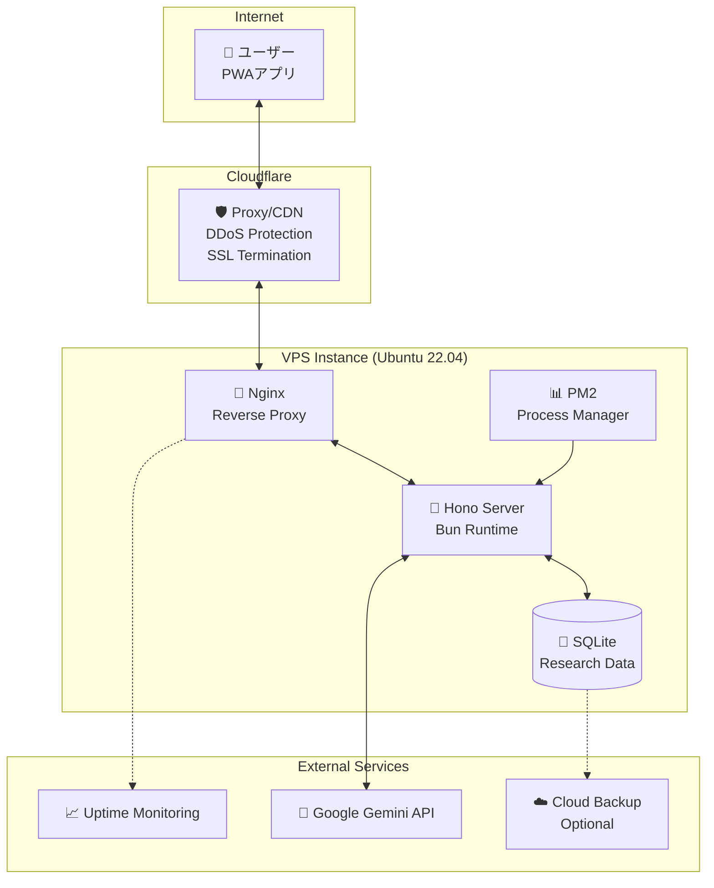

# インフラストラクチャ仕様書
*「頭の棚卸しノート」アプリ - インフラ設計・運用仕様*

## 📖 概要

### 選定方針
研究用短期プロトタイプという特性を考慮し、**コスト効率と運用の簡素化を重視**したインフラ構成を選定。実験中の安定動作を最優先とし、学生予算に適したソリューションを提供する。

### アーキテクチャ決定
- **推奨構成**: シンプルVPS（DigitalOcean/Linode/さくらVPS）
- **予算**: 月額 ¥3,000-5,000
- **運用期間**: 開発10週間 + 実験1週間 = 約3ヶ月
- **総インフラコスト**: ¥10,000-15,000

---

## 🏗️ システム構成

### 全体アーキテクチャ


### 推奨プロバイダー比較

| プロバイダー | スペック | 月額 | 特徴 | 推奨度 |
|------------|---------|------|------|--------|
| **DigitalOcean** | 2vCPU/4GB/50GB | $24 (~¥3,600) | 簡単セットアップ、豊富ドキュメント | ⭐⭐⭐ |
| **Linode** | 2vCPU/4GB/50GB | $24 (~¥3,600) | 高性能、東京DC | ⭐⭐⭐ |
| **さくらVPS** | 2vCPU/4GB/50GB | ¥3,520 | 国内、日本語サポート | ⭐⭐⭐ |
| **Vultr** | 2vCPU/4GB/50GB | $24 (~¥3,600) | 東京DC、柔軟性 | ⭐⭐ |

---

## ⚙️ サーバー設定

### 1. 基本システム構成

#### **OS・ランタイム**
```bash
# Ubuntu 22.04 LTS
ubuntu@concern-server:~$ lsb_release -a
No LSB modules are available.
Distributor ID: Ubuntu
Description:    Ubuntu 22.04.3 LTS
Release:        22.04
Codename:       jammy

# Node.js 20.x (Bun実行のため)
curl -fsSL https://deb.nodesource.com/setup_20.x | sudo -E bash -
sudo apt-get install -y nodejs

# Bun (最新stable)
curl -fsSL https://bun.sh/install | bash
```

#### **Webサーバー・プロキシ**
```nginx
# /etc/nginx/sites-available/concern-app
server {
    listen 80;
    server_name your-domain.com;
    
    # Cloudflare経由のみ許可
    include /etc/nginx/conf.d/cloudflare-real-ip.conf;
    
    location / {
        proxy_pass http://localhost:3000;
        proxy_http_version 1.1;
        proxy_set_header Upgrade $http_upgrade;
        proxy_set_header Connection 'upgrade';
        proxy_set_header Host $host;
        proxy_set_header X-Real-IP $remote_addr;
        proxy_set_header X-Forwarded-For $proxy_add_x_forwarded_for;
        proxy_set_header X-Forwarded-Proto $scheme;
        proxy_cache_bypass $http_upgrade;
        
        # API用の設定
        client_max_body_size 10M;
        proxy_read_timeout 30s;
        proxy_connect_timeout 5s;
    }
    
    # PWA Static Assets
    location /assets {
        alias /var/www/concern-app/dist/assets;
        expires 1y;
        add_header Cache-Control "public, immutable";
        add_header Access-Control-Allow-Origin "*";
    }
    
    # Health Check
    location /health {
        access_log off;
        return 200 "healthy\n";
        add_header Content-Type text/plain;
    }
}
```

#### **プロセス管理（PM2）**
```json
// ecosystem.config.js
module.exports = {
  apps: [
    {
      name: 'concern-app-server',
      script: 'bun',
      args: 'run src/index.ts',
      cwd: '/opt/concern-app/server',
      instances: 1,
      exec_mode: 'fork',
      
      // Environment
      env: {
        NODE_ENV: 'production',
        PORT: 3000,
        DATABASE_URL: '/opt/concern-app/data/production.db',
        GEMINI_API_KEY: process.env.GEMINI_API_KEY
      },
      
      // Logging
      out_file: '/var/log/concern-app/out.log',
      error_file: '/var/log/concern-app/error.log',
      log_file: '/var/log/concern-app/combined.log',
      
      // Auto-restart
      watch: false,
      max_restarts: 10,
      min_uptime: '10s',
      
      // Resource limits
      max_memory_restart: '500M'
    }
  ]
};
```

### 2. セキュリティ設定

#### **ファイアウォール（UFW）**
```bash
# 基本設定
sudo ufw default deny incoming
sudo ufw default allow outgoing

# 必要なポートのみ開放
sudo ufw allow ssh
sudo ufw allow 80/tcp
sudo ufw allow 443/tcp

# Cloudflare IP範囲のみ許可（オプション）
# sudo ufw allow from 173.245.48.0/20 to any port 80
# sudo ufw allow from 103.21.244.0/22 to any port 80
# ... 他のCloudflare IP ranges

sudo ufw enable
```

#### **fail2ban**
```ini
# /etc/fail2ban/jail.local
[DEFAULT]
bantime = 1h
findtime = 10m
maxretry = 5

[sshd]
enabled = true
port = ssh
logpath = %(sshd_log)s
backend = %(sshd_backend)s

[nginx-http-auth]
enabled = true
filter = nginx-http-auth
logpath = /var/log/nginx/error.log
maxretry = 3

[nginx-limit-req]
enabled = true
filter = nginx-limit-req
logpath = /var/log/nginx/error.log
maxretry = 10
```

#### **自動セキュリティアップデート**
```bash
# unattended-upgradesの設定
sudo apt install unattended-upgrades
sudo dpkg-reconfigure -plow unattended-upgrades

# /etc/apt/apt.conf.d/50unattended-upgrades
Unattended-Upgrade::Allowed-Origins {
    "${distro_id}:${distro_codename}-security";
    "${distro_id}ESMApps:${distro_codename}-apps-security";
    "${distro_id}ESM:${distro_codename}-infra-security";
};
```

### 3. データベース・バックアップ

#### **SQLite設定**
```bash
# データディレクトリ作成
sudo mkdir -p /opt/concern-app/data
sudo chown -R ubuntu:ubuntu /opt/concern-app/data

# SQLite最適化設定
sqlite3 /opt/concern-app/data/production.db "PRAGMA journal_mode=WAL;"
sqlite3 /opt/concern-app/data/production.db "PRAGMA synchronous=NORMAL;"
sqlite3 /opt/concern-app/data/production.db "PRAGMA cache_size=10000;"
```

#### **自動バックアップ**
```bash
#!/bin/bash
# /opt/concern-app/scripts/backup.sh
set -e

BACKUP_DIR="/opt/concern-app/backups"
DB_PATH="/opt/concern-app/data/production.db"
TIMESTAMP=$(date +%Y%m%d_%H%M%S)

# バックアップディレクトリ作成
mkdir -p $BACKUP_DIR

# SQLiteダンプ
sqlite3 $DB_PATH ".backup '$BACKUP_DIR/db_backup_$TIMESTAMP.db'"

# 古いバックアップ削除（7日以上）
find $BACKUP_DIR -name "db_backup_*.db" -mtime +7 -delete

# ログ
echo "$(date): Database backup completed: db_backup_$TIMESTAMP.db" >> /var/log/concern-app/backup.log

# オプション: クラウドストレージアップロード
# aws s3 cp $BACKUP_DIR/db_backup_$TIMESTAMP.db s3://concern-app-backups/
```

```bash
# crontab -e でスケジュール設定
# 毎日3:00にバックアップ実行
0 3 * * * /opt/concern-app/scripts/backup.sh
```

---

## 🚀 デプロイメント戦略

### 1. 自動デプロイ（GitHub Actions）

```yaml
# .github/workflows/deploy.yml
name: Deploy to Production

on:
  push:
    branches: [main]

jobs:
  deploy:
    runs-on: ubuntu-latest
    
    steps:
    - uses: actions/checkout@v3
    
    # フロントエンド（PWA）ビルド
    - name: Setup Node.js
      uses: actions/setup-node@v3
      with:
        node-version: '20'
        cache: 'npm'
        cache-dependency-path: 'client/package-lock.json'
    
    - name: Install dependencies (client)
      run: |
        cd client
        npm ci
    
    - name: Build PWA
      run: |
        cd client
        npm run build
    
    # サーバーサイド準備
    - name: Install Bun
      run: curl -fsSL https://bun.sh/install | bash
    
    - name: Install dependencies (server)
      run: |
        cd server
        $HOME/.bun/bin/bun install
    
    - name: Build server
      run: |
        cd server
        $HOME/.bun/bin/bun run build
    
    # デプロイ
    - name: Deploy to VPS
      uses: appleboy/ssh-action@v0.1.4
      with:
        host: ${{ secrets.VPS_HOST }}
        username: ${{ secrets.VPS_USER }}
        key: ${{ secrets.VPS_SSH_KEY }}
        script: |
          # アプリ更新
          cd /opt/concern-app
          git pull origin main
          
          # フロントエンド
          cd client
          npm ci
          npm run build
          sudo cp -r dist/* /var/www/concern-app/
          
          # サーバーサイド  
          cd ../server
          bun install
          bun run build
          
          # データベースマイグレーション
          bun run migrate
          
          # アプリ再起動
          pm2 restart concern-app-server
          
          # ヘルスチェック
          sleep 5
          curl -f http://localhost:3000/health || exit 1
```

### 2. 手動デプロイ手順

```bash
# 1. VPS接続
ssh ubuntu@your-server-ip

# 2. アプリディレクトリ
cd /opt/concern-app

# 3. コード更新
git pull origin main

# 4. 依存関係更新
cd client && npm ci && cd ../server && bun install

# 5. ビルド
cd ../client && npm run build
cd ../server && bun run build

# 6. データベースマイグレーション
bun run migrate

# 7. 静的ファイル配置
sudo cp -r /opt/concern-app/client/dist/* /var/www/concern-app/

# 8. アプリ再起動
pm2 restart concern-app-server

# 9. 動作確認
curl http://localhost:3000/health
curl https://your-domain.com/health
```

---

## 📊 監視・運用

### 1. システム監視

#### **Uptime監視（外部サービス）**
```
推奨サービス:
- UptimeRobot (無料枠: 50monitors, 5分間隔)
- Better Uptime (無料枠: 10monitors, 3分間隔)
- Pingdom (有料だが高機能)

監視項目:
- https://your-domain.com/health (HTTP 200チェック)
- https://your-domain.com/v1/config (API応答チェック)
- ping監視（サーバー生死確認）
```

#### **ログ監視**
```bash
# システムログ確認
sudo journalctl -u nginx -f
sudo journalctl -u pm2-ubuntu -f
tail -f /var/log/concern-app/combined.log

# リソース監視
htop
df -h
free -h
```

#### **アラート設定**
```bash
#!/bin/bash
# /opt/concern-app/scripts/health_check.sh
# crontabで5分毎実行

HEALTH_URL="http://localhost:3000/health"
LOG_FILE="/var/log/concern-app/health.log"

if ! curl -sf $HEALTH_URL > /dev/null; then
    echo "$(date): Health check failed!" >> $LOG_FILE
    
    # PM2でアプリ再起動
    pm2 restart concern-app-server
    
    # 管理者通知（オプション）
    # curl -X POST https://hooks.slack.com/... -d "payload={...}"
else
    echo "$(date): Health check OK" >> $LOG_FILE
fi
```

### 2. パフォーマンス最適化

#### **Nginx最適化**
```nginx
# /etc/nginx/nginx.conf 主要設定
worker_processes auto;
worker_connections 1024;

# Gzip圧縮
gzip on;
gzip_vary on;
gzip_min_length 1024;
gzip_types text/plain text/css application/json application/javascript text/xml application/xml application/xml+rss text/javascript;

# キャッシュ設定
open_file_cache max=1000 inactive=20s;
open_file_cache_valid 30s;
open_file_cache_min_uses 2;
open_file_cache_errors on;
```

#### **SQLite最適化**
```sql
-- 定期的なVACUUM（週次実行）
VACUUM;

-- インデックス最適化
ANALYZE;

-- WALモードの確認
PRAGMA journal_mode;
-- 結果: wal

-- キャッシュサイズ確認  
PRAGMA cache_size;
-- 結果: 10000 (約40MB)
```

### 3. 研究データ管理

#### **データ保持ポリシー**
```sql
-- 研究データ: 180日保持
DELETE FROM measurement_events WHERE recorded_at < datetime('now', '-180 days');
DELETE FROM ui_generation_requests WHERE requested_at < datetime('now', '-180 days');

-- 運用ログ: 30日保持
DELETE FROM system_logs WHERE logged_at < datetime('now', '-30 days');
```

#### **データエクスポート**
```bash
#!/bin/bash
# /opt/concern-app/scripts/research_export.sh
# 研究終了時のデータエクスポート

EXPORT_DIR="/opt/concern-app/exports/$(date +%Y%m%d)"
mkdir -p $EXPORT_DIR

# 研究データをCSVエクスポート
sqlite3 -header -csv /opt/concern-app/data/production.db \
  "SELECT * FROM measurement_events;" > $EXPORT_DIR/measurement_events.csv

sqlite3 -header -csv /opt/concern-app/data/production.db \
  "SELECT * FROM ui_generation_requests;" > $EXPORT_DIR/ui_generation_requests.csv

# ZIP圧縮
cd /opt/concern-app/exports
zip -r research_data_$(date +%Y%m%d).zip $(date +%Y%m%d)/

echo "Research data exported to: research_data_$(date +%Y%m%d).zip"
```

---

## 💰 コスト・予算

### 月額費用内訳

| 項目 | サービス | 月額費用 |
|------|----------|----------|
| **VPS** | DigitalOcean Droplet | ¥3,600 |
| **ドメイン** | お名前.com等 | ¥100 |
| **DNS・CDN** | Cloudflare (Free) | ¥0 |
| **監視** | UptimeRobot (Free) | ¥0 |
| **API** | Google Gemini (従量課金) | ¥500-1,000 |
| **予備** | 予期しない費用 | ¥500 |
| **合計** | | **¥4,700/月** |

### 研究期間総費用
- **開発期間**: 2.5ヶ月 × ¥4,700 = ¥11,750
- **実験期間**: 0.5ヶ月 × ¥4,700 = ¥2,350
- **合計**: **約¥15,000**

---

## 🔄 オンプレミス構成（代替案）

### 推奨ハードウェア
```
最低要件:
- CPU: 2コア以上
- RAM: 4GB以上  
- Storage: 50GB以上
- Network: 安定したインターネット接続

推奨ハードウェア:
- Raspberry Pi 4 (8GB) + SSD
- 中古PC (Core i5 + 8GB RAM)
- 既存のLinuxサーバー
```

### 追加考慮事項
```
- 動的DNS設定（No-IP、DuckDNS等）
- ルーターのポート開放設定
- UPS（無停電電源装置）推奨
- 固定IPアドレス（オプション）
- 24時間監視体制
```

## 🎯 最終推奨

研究の成功を最優先とし、**VPS構成（Option A）を強く推奨**します。

**決定理由:**
1. **リスク最小化**: 実験中のインフラ障害を回避
2. **予算適正**: 月¥5,000以下で十分実現可能
3. **運用性**: 学習コストと運用負荷の最適化
4. **拡張性**: 必要に応じた柔軟な対応

---

*作成日: 2025年9月17日*  
*バージョン: v1.0*  
*対応MVP要件: v2.0*
