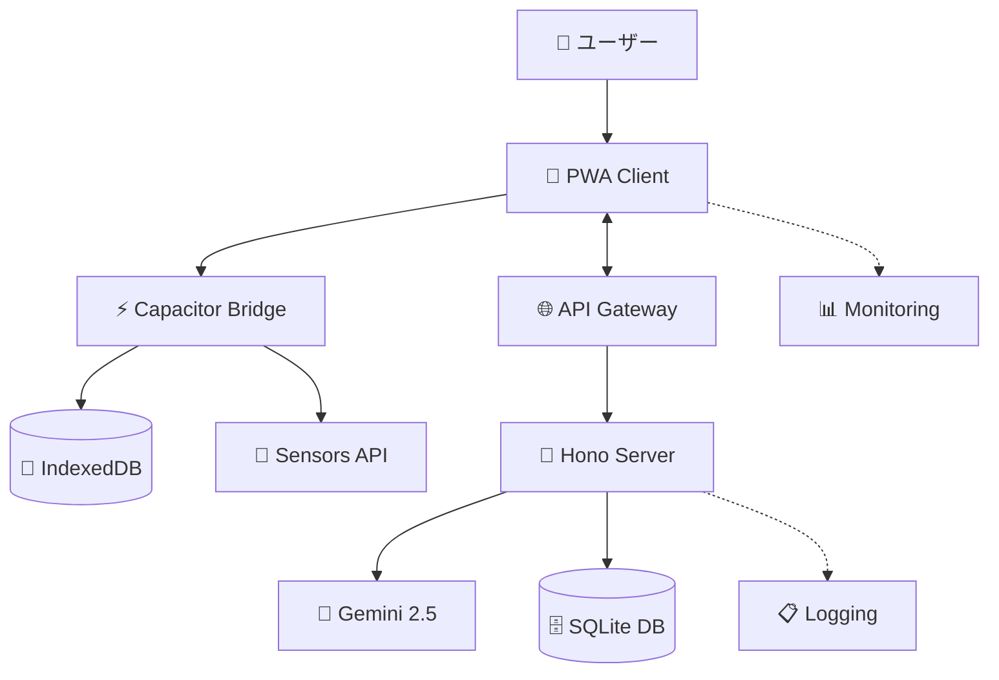
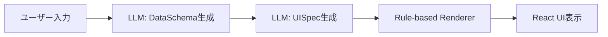
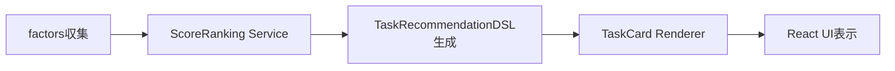
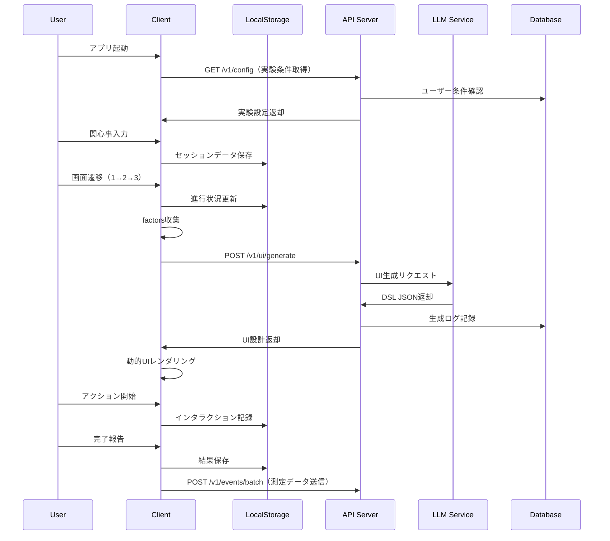
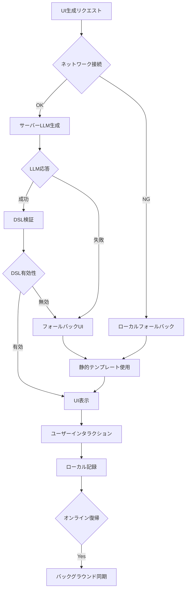

# アーキテクチャ設計書 v2.0
*「頭の棚卸しノート」アプリ - システム全体設計*

**更新履歴:**
- v1.0 (2025/09/17): 初版（Phase 0完成時）
- v2.0 (2025/10/12): **2系統DSL対応版**（思考整理 + タスク推奨の分離設計）

---

## 📖 概要

### 設計思想
- **研究価値の最大化**: 動的UI効果の精密測定
- **プライバシー・ファースト**: 個人情報の適切な分離管理
- **拡張性**: factors辞書による無限センサー対応
- **実用性**: PWAからネイティブアプリへの段階的移行
- **堅牢性**: エラー処理とフォールバック機構の充実
- **🆕 2層モデル採用**: Jelly (CHI 2025)の思想に基づくDataSchema + UISpec分離設計

### システム全体像


---

## 🏗️ アーキテクチャレイヤー

### Layer 1: プレゼンテーション層

#### **PWA Client (React + TypeScript + Capacitor)**
```
src/
├── components/          # UI Components
│   ├── screens/        # 5つのメイン画面
│   ├── ui/            # 再利用可能UIパーツ
│   └── dynamic/       # 動的UI生成コンポーネント
├── hooks/             # React Hooks
├── services/          # ビジネスロジック
│   ├── storage/       # ローカルデータ管理
│   ├── api/          # サーバー通信
│   ├── context/      # factors収集
│   └── ui-generation/ # UI生成・レンダリング
├── types/            # TypeScript型定義
└── utils/            # ユーティリティ
```

**技術スタック:**
- **React 18**: 関数コンポーネント + Hooks
- **TypeScript**: 型安全性
- **Vite**: 高速ビルド
- **Capacitor**: ネイティブブリッジ
- **IndexedDB**: ローカルストレージ（Dexie.js）
- **Tailwind CSS**: スタイリング

**主要機能:**
- 5画面フロー実装
- factors辞書によるコンテキスト収集
- 動的UI DSLレンダリング
- オフライン対応
- A/Bテスト機能

#### **Capacitor Native Bridge**
```javascript
// センサーデータ収集
import { Geolocation } from '@capacitor/geolocation';
import { Motion } from '@capacitor/motion';
import { Device } from '@capacitor/device';

async function collectFactors(): Promise<FactorsDict> {
  const factors: FactorsDict = {};
  
  // 位置情報（抽象化）
  const position = await Geolocation.getCurrentPosition();
  factors.location_category = {
    value: abstractizeLocation(position),
    confidence: position.coords.accuracy,
    source: 'gps_sensor'
  };
  
  // デバイス情報
  const deviceInfo = await Device.getInfo();
  factors.device_orientation = {
    value: deviceInfo.orientation,
    source: 'device_api'
  };
  
  // 将来拡張: Motion, Calendar, etc.
  
  return factors;
}
```

---

### Layer 2: ビジネスロジック層

---

## 🆕 2系統DSLアーキテクチャ（v2.0の核心）

### 系統1: 思考整理DSL（DataSchema + UISpec）
**適用範囲:** capture, plan, breakdown



### 系統2: タスク推奨DSL（Schema不要）
**適用範囲:** home推奨



**参考文献:** [Jelly: Generative and Malleable User Interfaces (CHI 2025)](https://arxiv.org/html/2503.04084v1)

---

#### **Context Service（factors辞書管理）**
```typescript
interface FactorsDict {
  [factorName: string]: {
    value: string | number | boolean | object;
    confidence?: number;  // 0-1
    source?: string;
    timestamp?: Date;
  };
}

class ContextService {
  private factors: FactorsDict = {};
  
  async collectCurrentFactors(): Promise<FactorsDict> {
    // 基本コンテキスト
    this.factors.time_of_day = {
      value: this.getTimeOfDay(),
      source: 'system_clock'
    };
    
    // センサーデータ（プライバシー考慮）
    await this.collectLocationFactor();
    await this.collectActivityFactor();
    
    // 将来拡張
    await this.collectCalendarFactor();
    await this.collectBiometricFactor();
    
    return this.factors;
  }
  
  private async collectLocationFactor() {
    try {
      const position = await Geolocation.getCurrentPosition();
      this.factors.location_category = {
        value: this.categorizeLocation(position), // home/work/other
        confidence: this.calculateLocationConfidence(position),
        source: 'gps_abstraction'
      };
    } catch (error) {
      // フォールバック: 時間ベース推定
      this.factors.location_category = {
        value: this.inferLocationFromTime(),
        confidence: 0.3,
        source: 'time_inference'
      };
    }
  }
}
```

#### **🆕 Thought Organization Service（思考整理UI生成）**
```typescript
// 系統1: 思考整理DSL生成サービス
class ThoughtOrganizationService {
  async generateUI(request: {
    stage: 'capture' | 'plan' | 'breakdown';
    concernText: string;
    factors: FactorsDict;
    previousSchema?: DataSchemaDSL;
  }): Promise<{ dataSchema: DataSchemaDSL; uiSpec: UISpecDSL }> {
    
    if (request.stage === 'plan') {
      // ✅ planステージ: フルパイプライン
      // DataSchema生成 → UISpec生成
      const dataSchema = await this.llm.generateDataSchema({
        concernText: request.concernText,
        stage: 'plan',
        previousSchema: request.previousSchema
      });
      
      const uiSpec = await this.llm.generateUISpec({
        dataSchema,
        factors: request.factors,
        stage: 'plan'
      });
      
      return { dataSchema, uiSpec };
      
    } else if (request.stage === 'capture') {
      // ✅ captureステージ: 簡易パイプライン
      // 固定Schema + 内容調整
      const dataSchema = this.getFixedCaptureSchema();
      
      const uiSpec = await this.llm.adjustUISpec({
        dataSchema,
        concernText: request.concernText,
        stage: 'capture'
      });
      
      return { dataSchema, uiSpec };
      
    } else {
      // ✅ breakdownステージ: 最簡易（固定Template）
      const template = this.getFixedBreakdownTemplate(request.previousSchema);
      return { dataSchema: template.dataSchema, uiSpec: template.uiSpec };
    }
  }
  
  private anonymizeContext(context: ContextData) {
    const anonymized = { ...context };
    
    // factors辞書の抽象化
    for (const [key, factor] of Object.entries(context.factors)) {
      if (this.isPersonallyIdentifiable(factor)) {
        anonymized.factors[key] = {
          ...factor,
          value: this.abstractValue(factor.value),
        };
      }
    }
    
    return anonymized;
  }
}
```

#### **🆕 Task Recommendation Service（タスク推奨）**
```typescript
// 系統2: タスク推奨DSL生成サービス（Schema不要）
class TaskRecommendationService {
  async selectAndRender(request: {
    available_time: number;
    factors: FactorsDict;
    tasks: Task[];
  }): Promise<TaskRecommendationDSL> {
    
    // ✅ Step 1: スコアリング
    const scored = request.tasks.map(task => ({
      task,
      score: this.calculateScore(task, request.factors)
    }));
    
    // ✅ Step 2: ランキング
    const ranked = scored.sort((a, b) => b.score - a.score);
    const topTask = ranked[0].task;
    
    // ✅ Step 3: ゲーティング（variant決定）
    const variant = this.applyGating(topTask, request.available_time);
    
    // ✅ Step 4: サリエンシー決定
    const saliency = this.calculateSaliency(topTask);
    
    // ✅ Step 5: TaskRecommendationDSL生成
    return {
      version: "1.0",
      type: "task_recommendation",
      selectedTask: {
        taskId: topTask.id,
        variant,
        saliency
      },
      taskCard: this.getTaskCardSpec(),
      scoring: this.getScoringSpec()
    };
  }
  
  private calculateScore(task: Task, factors: FactorsDict): number {
    const importance = task.importance;
    const urgencyN = 1 - this.logistic(task.due_in_hours, 48, 0.1);
    const stalenessN = this.logistic(task.days_since_last_touch, 3, 1.5);
    const contextFitN = this.calculateContextFit(task, factors);
    
    return 0.4 * importance + 0.3 * urgencyN + 0.2 * stalenessN + 0.1 * contextFitN;
  }
}
```

---

### Layer 3: データアクセス層

#### **Local Storage Service（IndexedDB）**
```typescript
// Dexie.jsによるIndexedDB管理
class LocalDatabase extends Dexie {
  userProfile!: Table<UserProfile>;
  concernSessions!: Table<ConcernSession>;
  contextData!: Table<ContextData>;
  interactionEvents!: Table<InteractionEvent>;
  
  constructor() {
    super('ConcernApp');
    this.version(1).stores({
      userProfile: 'userId',
      concernSessions: 'sessionId, userId, startTime',
      contextData: 'contextId, sessionId, collectedAt',
      interactionEvents: 'eventId, sessionId, timestamp, syncedToServer'
    });
  }
  
  // プライバシー保護付きクエリ
  async getSessionsForAnalysis(userId: string): Promise<ConcernSession[]> {
    return await this.concernSessions
      .where('userId').equals(userId)
      .and(session => session.completed === true)
      .toArray();
  }
  
  // 未同期イベント取得
  async getUnsyncedEvents(limit: number = 50): Promise<InteractionEvent[]> {
    return await this.interactionEvents
      .where('syncedToServer').equals(false)
      .limit(limit)
      .toArray();
  }
}
```

---

### Layer 4: サーバーサイド

#### **Bun + Hono API Server**
```typescript
import { Hono } from 'hono';
import { cors } from 'hono/cors';
import { logger } from 'hono/logger';

const app = new Hono();

// ミドルウェア
app.use('*', cors({
  origin: process.env.ALLOWED_ORIGINS?.split(',') || ['http://localhost:5173'],
  credentials: true
}));
app.use('*', logger());
app.use('*', authMiddleware);
app.use('*', rateLimitMiddleware);

// API Routes
app.route('/v1/config', configRoutes);
app.route('/v1/ui', uiGenerationRoutes);
app.route('/v1/score', priorityScoreRoutes);
app.route('/v1/events', eventLoggingRoutes);
app.route('/v1/replay', replayRoutes);

export default {
  port: process.env.PORT || 3000,
  fetch: app.fetch,
};
```

#### **UI Generation Handler**
```typescript
export const uiGenerationRoutes = new Hono()
  .post('/generate', async (c) => {
    const request = await c.req.json() as UIGenerationRequest;
    
    try {
      // バリデーション
      const validatedRequest = validateUIGenerationRequest(request);
      
      // LLM呼び出し
      const generationResult = await generateWithLLM(validatedRequest);
      
      // DSL検証
      const validatedDSL = validateDSL(generationResult.uiDsl);
      
      // DB記録
      await db.ui_generation_requests.create({
        generation_id: generationResult.generationId,
        session_id: request.sessionId,
        anonymous_user_id: request.anonymousUserId,
        concern_text: request.userExplicitInput.concernText,
        // ... その他のフィールド
      });
      
      return c.json({
        sessionId: request.sessionId,
        generationId: generationResult.generationId,
        uiDsl: validatedDSL,
        generation: generationResult.metadata
      });
      
    } catch (error) {
      // フォールバック処理
      const fallbackUI = await getFallbackUI(request);
      
      return c.json({
        ...fallbackUI,
        fallback: { used: true, reason: error.message }
      });
    }
  });
```

#### **LLM Integration Service**
```typescript
import { GoogleGenerativeAI } from '@google/generative-ai';

class LLMService {
  private genAI = new GoogleGenerativeAI(process.env.GEMINI_API_KEY!);
  
  async generateUI(request: UIGenerationRequest): Promise<UIDSL> {
    const model = this.genAI.getGenerativeModel({ 
      model: 'gemini-2.5-mini',
      generationConfig: {
        temperature: 0.3,
        topP: 0.8,
        topK: 40,
        maxOutputTokens: 1000
      }
    });
    
    const prompt = this.buildPrompt(request);
    const result = await model.generateContent({
      contents: [{ role: 'user', parts: [{ text: prompt }] }]
    });
    
    const response = result.response;
    const uiDsl = JSON.parse(response.text());
    
    return uiDsl;
  }
  
  private buildPrompt(request: UIGenerationRequest): string {
    return `
あなたは認知行動療法に基づく「頭の棚卸しノート」アプリのUIアシスタントです。

ユーザーの関心事: "${request.userExplicitInput.concernText}"
カテゴリ: ${request.userExplicitInput.selectedCategory}
アプローチ: ${request.userExplicitInput.selectedApproach}
緊急度: ${request.userExplicitInput.urgencyChoice}

現在の状況:
- 時間帯: ${request.systemInferredContext.timeOfDay}
- 利用可能時間: ${request.systemInferredContext.availableTimeMin}分
- 場所: ${request.systemInferredContext.factors.location_category?.value}
- アクティビティ: ${request.systemInferredContext.factors.activity_level?.value}

新規性レベル: ${request.noveltyLevel}

以下のUI DSL v1.1仕様に従い、2分ルールで着手しやすいUIを生成してください...
    `;
  }
}
```

---

## 🔄 データフロー設計

### 1. セッション開始から完了まで



### 2. オフライン・エラー対応



---

## 🛡️ セキュリティアーキテクチャ

### プライバシー保護レイヤー
```typescript
// データ分類と処理方針
interface DataClassification {
  PERSONAL_IDENTIFIABLE: {
    storage: 'local_only';
    examples: ['GPS座標', '具体的予定', 'デバイスID'];
  };
  USER_EXPLICIT: {
    storage: 'local_and_server';
    processing: 'as_is';
    examples: ['関心事テキスト', 'ユーザー選択項目'];
  };
  SYSTEM_INFERRED: {
    storage: 'local_and_server';
    processing: 'anonymized';
    examples: ['location_category', 'activity_level'];
  };
}

class PrivacyManager {
  static classifyData(data: any): DataClassification {
    // データ種別自動判定
  }
  
  static anonymizeForServer(data: any): any {
    // サーバー送信用匿名化処理
  }
  
  static validatePrivacyCompliance(request: any): boolean {
    // プライバシー要件チェック
  }
}
```

### 認証・認可
```typescript
// JWTベース認証（将来実装）
interface AuthService {
  generateAnonymousToken(deviceId: string): Promise<string>;
  validateToken(token: string): Promise<TokenPayload>;
  refreshToken(token: string): Promise<string>;
}

// レート制限
interface RateLimiter {
  checkLimit(userId: string, endpoint: string): Promise<boolean>;
  recordRequest(userId: string, endpoint: string): Promise<void>;
}
```

---

## 📊 監視・可観測性

### メトリクス収集
```typescript
interface SystemMetrics {
  // パフォーマンス
  uiGenerationLatency: Histogram;
  apiResponseTime: Histogram;
  databaseQueryTime: Histogram;
  
  // ビジネスロジック
  uiConversionRate: Counter;
  fallbackUsageRate: Counter;
  userEngagement: Gauge;
  
  // システムヘルス
  errorRate: Counter;
  uptime: Gauge;
  resourceUsage: Gauge;
}
```

### ログ設計
```typescript
interface StructuredLog {
  timestamp: string;
  level: 'INFO' | 'WARN' | 'ERROR';
  component: string;
  message: string;
  requestId?: string;
  userId?: string;  // 匿名化済み
  metadata: Record<string, any>;
}
```

---

## 🚀 デプロイメント・インフラ

### 開発環境
```yaml
# docker-compose.dev.yml
version: '3.8'
services:
  client:
    build: ./client
    ports: ["5173:5173"]
    volumes: ["./client:/app"]
    
  server:
    build: ./server
    ports: ["3000:3000"]
    environment:
      - NODE_ENV=development
      - DATABASE_URL=sqlite:./dev.db
    volumes: ["./server:/app"]
    
  database:
    image: sqlite:latest
    volumes: ["./data:/data"]
```

### 本番環境（将来）
```yaml
# k8s deployment example
apiVersion: apps/v1
kind: Deployment
metadata:
  name: concern-app-server
spec:
  replicas: 3
  selector:
    matchLabels:
      app: concern-app-server
  template:
    spec:
      containers:
      - name: server
        image: concern-app:latest
        ports:
        - containerPort: 3000
        env:
        - name: DATABASE_URL
          valueFrom:
            secretKeyRef:
              name: db-secret
              key: url
```

---

## ⚡ パフォーマンス最適化

### フロントエンド最適化
- **Code Splitting**: 画面ごとの動的インポート
- **Service Worker**: オフライン対応・キャッシュ戦略
- **Virtual Scrolling**: 大量データ表示
- **React.memo**: 不要な再レンダリング防止

### バックエンド最適化
- **Connection Pooling**: データベース接続最適化
- **LLM Response Caching**: 同一リクエストの結果キャッシュ
- **Batch Processing**: イベントログの効率的処理
- **CDN**: 静的アセットの高速配信

---

---

## 🆕 v2.0追加: 2系統DSL実装方針

### 実装優先度
1. **Phase 1A**: 思考整理DSL（capture/plan/breakdown）
2. **Phase 1B**: タスク推奨DSL（home推奨）
3. **Phase 1C**: Rule-based Rendering統合

### API構造（v2.0）

#### 系統1: 思考整理API
```
POST /v1/thought/generate        - DataSchema + UISpec一括生成
POST /v1/thought/generate-schema - DataSchemaのみ生成
POST /v1/thought/generate-uispec - UISpecのみ生成
```

#### 系統2: タスク推奨API
```
POST /v1/task/rank              - TaskRecommendationDSL生成
```

### Rule-based Rendering実装

**ComponentMapper:**
- DSL `render`値 → React Component
- `saliency`値 → Tailwind CSSクラス
- カスタムウィジェット拡張ポイント

**主要ウィジェット:**
1. TextAreaWidget (paragraph)
2. InputWidget (shortText)
3. NumberInputWidget (number)
4. RadioGroupWidget (radio)
5. CategoryPickerWidget (category)
6. ListWidget (expanded)
7. SummaryListWidget (summary)
8. DynamicWidget (custom)
9. TaskCardWidget (タスクカード)

---

*作成日: 2025年9月17日*  
*最終更新: 2025年10月12日*  
*バージョン: v2.0（2系統DSL対応版）*  
*対応MVP要件: v2.0*
